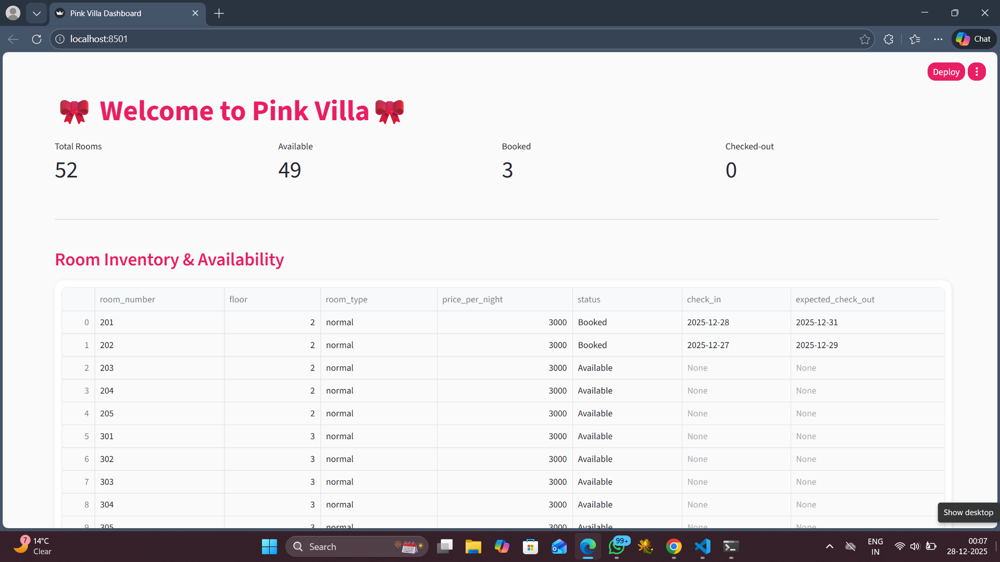

# Agentic AI System for a Resort (Pink Villa)

This project was built as part of an assignment to understand how an agent-based AI system can be designed for a real-world use case like a resort.

The goal was not just to answer questions, but to design a system where different agents handle different responsibilities (reception, restaurant, room service), persist data, and update an admin dashboard.

---

## Why I built this

Instead of building a simple chatbot, I wanted to simulate how an actual resort works:
- Guests can book rooms
- Guests can order food
- Guests can request room services
- Staff can monitor everything from a dashboard

The focus was on **system design**, **data flow**, and **clear separation of responsibilities**, not just AI responses.

---

## What the system currently does

### 1. Chat-based guest interaction
Guests interact through a single chat interface.

Depending on the message, the system routes the request to:
- Receptionist agent (booking, facilities, general queries)
- Restaurant agent (food orders)
- Room service agent (cleaning, amenities)
- Checkout flow

If an LLM is available, it is used for intent detection.
If not, the system safely falls back to rule-based routing.

---

### 2. Receptionist Agent
- Handles room booking (normal / sea-facing / penthouse)
- Checks room availability from database
- Manages check-in and check-out dates
- Stores stay details in database
- Answering general facility-related queries (gym, spa, pool, etc.)
---

### 3. Restaurant Agent
- Reads menu from Excel file
- Takes food orders with quantities
- Supports quantities and multiple items
- Calculates total bill
- Stores order details with status (Pending / Completed)

---

### 4. Room Service Agent
- Handles requests like towels, cleaning, laundry
- Stores requests with status tracking

---

### 5. Admin Dashboard (Streamlit)
A simple admin dashboard is provided for staff to:
- View room inventory and availability
- View guest stays
- View restaurant orders and update status
- View room service requests and update status

This dashboard is meant for internal operations, not guests.

---

## Screenshots

## Chat Flow Examples

### Room Booking


---

### Restaurant Food Ordering


---

### Facility Enquiry (Gym)


---

### Room Service Request


---

## Admin Dashboard

### Dashboard Overview


### Room Inventory & Availability


### Restaurant Orders Monitoring


### Room Service Monitoring


## Tech Stack Used

- Python
- SQLite
- Streamlit (dashboard)
- LangChain + OpenAI (LLM routing)
- Pandas (menu ingestion)

---

## How to run the project locally

```bash
# 1. Create virtual environment
python -m venv .venv

# 2. Activate environment (Windows)
.venv\Scripts\activate

# 3. Install dependencies
pip install -r requirements.txt

# 4. Run the chat-based application
python app.py

# 5. Run the admin dashboard
streamlit run dashboard/dashboard.py


